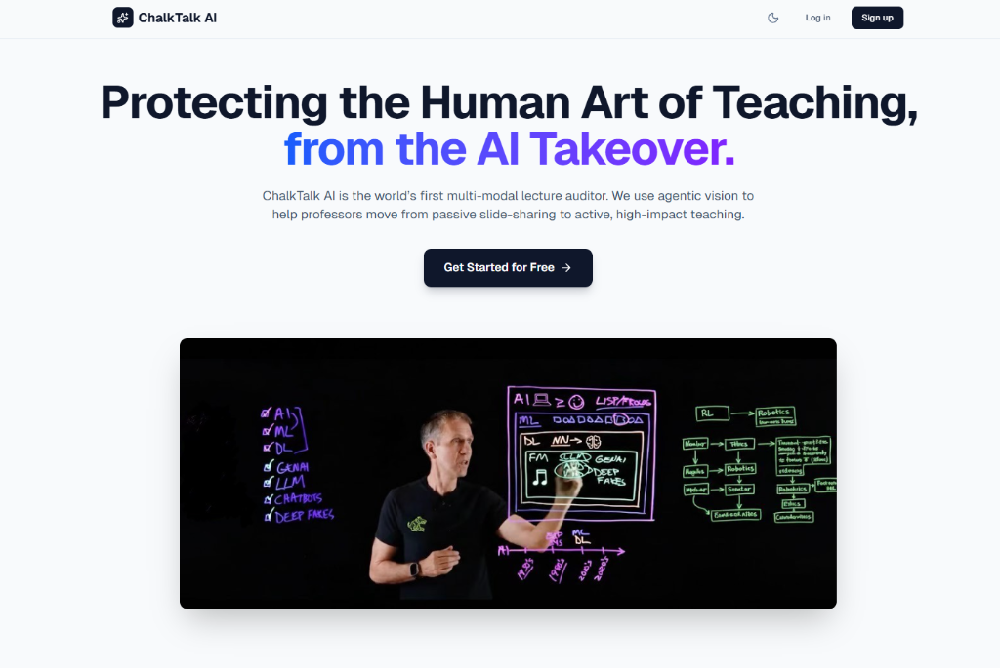
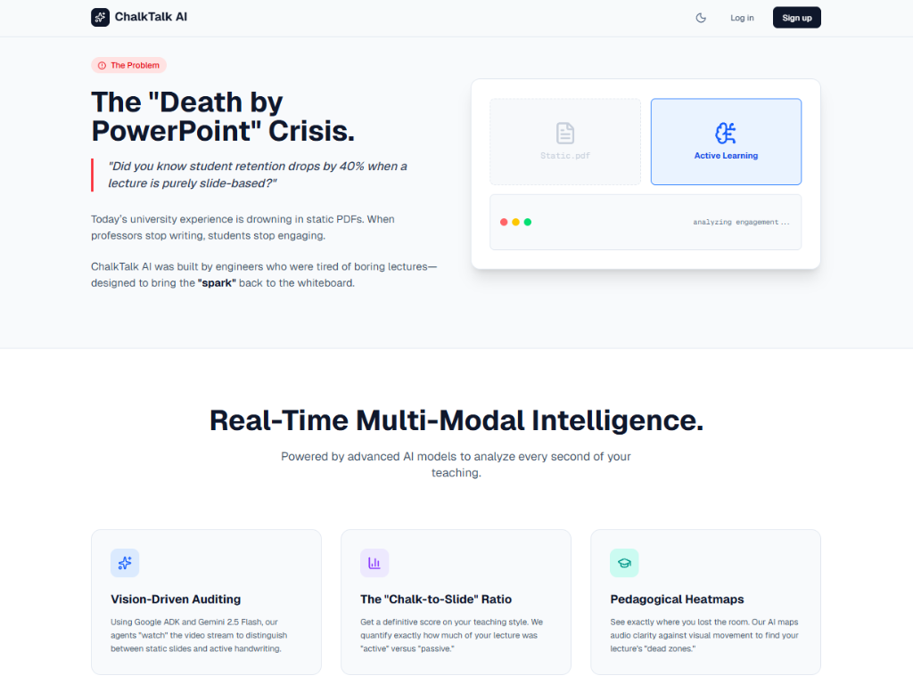
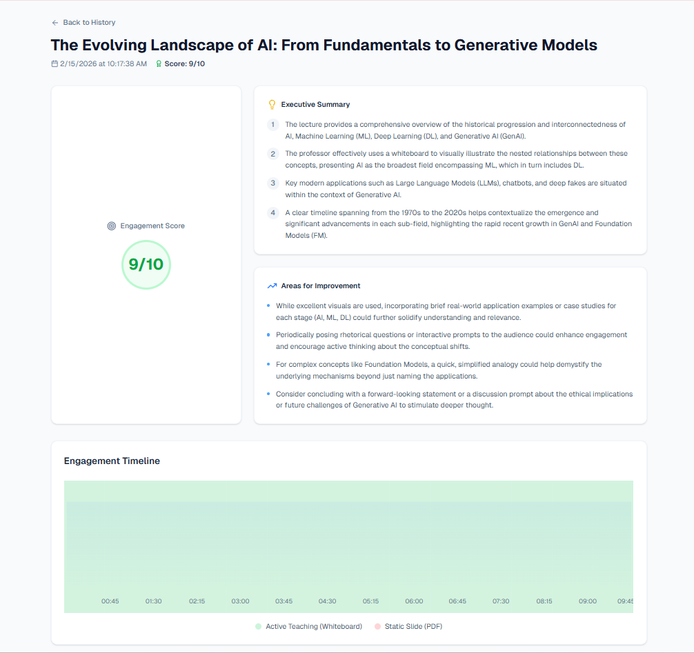

# ChalkTalk AI 🎓
### AI-Powered Teaching Analytics Platform


> **"Stop guessing how your class went. Start measuring it."**

ChalkTalk AI is a full-stack analytics platform that audits university lectures. It uses multimodal AI to quantify **"Active Teaching"** (board usage, gesturing, Socratic questioning) vs. **"Passive Delivery"** (reading off slides).



*Highlighting the "Death by PowerPoint" crisis in education.*

---


*Modern landing page ensuring a premium first impression.*

---



*AI-driven analysis of a lecture, showing engagement score and timeline.*

---


## 💡 Inspiration
**Why do we sometimes learn more from a 20-year-old video of a professor with a piece of chalk than from a modern 4K live stream?**

We asked ourselves this while watching a lecture where the professor just read off "Slide 42 of 90." The difference wasn't the camera quality, it was the **energy**. The best teachers don't just display information; they build it with you, using movement, gestures, and the board.

We realized that "Death by PowerPoint" isn't a lack of effort; it's a lack of feedback. Professors rarely get to see their teaching from the student's perspective. We built ChalkTalk AI not to critique teachers, but to be a supportive **"Smart Mirror"**, giving them the data they need to bring the spark back to the classroom.

## 🎯 What it does
ChalkTalk AI is a friendly lecture companion that helps professors understand their teaching dynamics. It moves beyond simple transcription to analyze the **"Art of Delivery."**

Using multimodal AI, it "watches" and "listens" to the lecture to generate:

*   **The "Active Delivery" Timeline:** A visual breakdown showing how much time was spent on "Static Delivery" (reading slides) vs. "Dynamic Delivery" (whiteboarding, gesturing, engaging).
*   **Engagement Pulse:** By combining voice energy with visual motion, we identify "High-Impact Moments" where the class was likely most attentive.
*   **The Coaching Corner:** An AI-generated summary that highlights strengths (e.g., *"Great energy when explaining the NFA concept!"*) and offers gentle suggestions (e.g., *"The segment at 22:00 was a bit static; maybe try a diagram here next time?"*).

## ⚙️ How we built it
We wanted ChalkTalk AI to be fast, private, and helpful:

*   **The Eyes:** We used **OpenCV** to track movement and gestures, creating a "Kinetic Score" for the lecture.
*   **The Brain:** We hooked up **Google Gemini 2.5 Flash** via **Google AI Studio**. It looks at video frames + audio to understand the context, knowing the difference between a pause for effect and a pause of confusion.
*   **The Engine:** A **Python & FastAPI** backend handles the heavy video processing.
*   **The Look:** A clean **Next.js 15** dashboard with **Recharts**, designed to be friendly and readable for non-tech faculty.
*   **The Home:** Hosted on **DigitalOcean** with **MongoDB Atlas** keeping the data safe.

## 🧠 Challenges we ran into
*   **Capturing "Vibe":** Teaching is nuanced! It was tricky to teach the AI the difference between meaningful gestures (explaining a concept) and random movement. We spent a lot of time refining our prompts to get it right.
*   **Fairness:** We didn't want to penalize quiet, intense teaching styles. Balancing our "Engagement Score" to appreciate different types of good teaching took several iterations.
*   **The Sync:** Aligning audio sentiment with visual cues down to the second was a tough engineering puzzle, but crucial for accurate feedback.

## 🏆 Accomplishments that we're proud of
*   **From Data to Empathy:** We didn't just output cold graphs. We managed to generate feedback that feels supportive and human, like a mentor.
*   **Quantifying the Unquantifiable:** We successfully built a metric for "Teacher Presence", something we weren't sure was possible when we started!
*   **It's Fast:** We optimized our pipeline so professors don't have to wait hours to see their results.

## 📚 What we learned
*   **Context is King:** A transcript misses half the story. You have to see the teaching, the pointing, the hesitation, the excitement, to truly understand it.
*   **Teachers Want to Grow:** Every educator we talked to wants to reach their students better; they just need the right tools to see how.
*   **Multimodal Magic:** Combining vision and text models allowed us to solve problems that neither model could handle alone.

## 🔮 What's next for ChalkTalk AI
*   **Self-Reflection Mode:** Letting professors add their own notes to the timeline ("I felt rushed here") to compare their feelings with the AI's data.
*   **The Student Simulator:** Using the lecture content to generate "Practice Questions," helping professors prepare for Q&A sessions before class even starts.
*   **Accessibility Check:** Automatically flagging moments where the professor says "Look at this" without describing it, helping make lectures better for blind students.

---

## 🏗️ Architecture

[User Upload] -> [Backend API (FastAPI)] -> [Video Processing (OpenCV)] -> [AI Analysis (Gemini 2.5)] -> [MongoDB] -> [Frontend Dashboard (Next.js)]

---

## 🚀 Quick Start (Local Development)

### Prerequisites
* **Node.js** v18+
* **Python** 3.11+
* **uv** (Python Package Manager): [Install uv](https://github.com/astral-sh/uv)
    * `curl -LsSf https://astral.sh/uv/install.sh | sh` (macOS/Linux)
    * `powershell -c "irm https://astral.sh/uv/install.ps1 | iex"` (Windows)
* **MongoDB**: Connection string for MongoDB Atlas.

### 1. Backend Setup
```bash
cd backend

# Install dependencies using uv
uv sync

# Configuration
# Copy the example env file and fill in your details:
cp .env.example .env
# Edit .env and add:
# GOOGLE_API_KEY=your_gemini_api_key
# MONGO_URI=your_mongodb_connection_string
# MONGO_DB_NAME=chalktalk_ai

# Run Server
uv run uvicorn main:app --reload --port 8000
```

### 2. Frontend Setup
```bash
cd frontend

# Install dependencies
npm install

# Configuration
# Copy the example env file:
cp .env.local.example .env.local
# (Default is http://127.0.0.1:8000, which is correct for local dev)

# Run Server
npm run dev
```

### 3. Usage
1. Open [http://localhost:3000](http://localhost:3000).
2. **Sign Up** for an account.
3. **Upload** a lecture video file (`.mp4`) or paste a link.
4. Wait for the analysis pipeline to complete.
5. View your **Executive Summary** and **Heatmap**!

---

## 📦 Deployment (DigitalOcean)

This project is configured for **DigitalOcean App Platform** using the included `Dockerfile`.

1.  **Fork this repo.**
2.  Create a new **App** in DigitalOcean.
3.  Connect your GitHub repository and select the `main` branch.
4.  **Environment Variables (CRITICAL):**
    You MUST add the following variables in the DigitalOcean App Settings -> Components -> `chalktalk-ai` -> Environment Variables:
    *   `GOOGLE_API_KEY`: Your Gemini API Key.
    *   `MONGO_URI`: Your Full MongoDB Connection String.
    *   `MONGO_DB_NAME`: `chalktalk_ai` (or your preferred DB name).
    *   `NEXT_PUBLIC_API_URL`: `/api` (Optional, but recommended for explicit routing).

5.  **Deploy:** DigitalOcean will build the Docker container and launch the app.

---

## 🤝 Contributing
Found a bug? Want to add "Tone Analysis"? PRs are welcome!

1. Fork the Project
2. Create your Feature Branch (`git checkout -b feature/AmazingFeature`)
3. Commit your Changes (`git commit -m 'Add some AmazingFeature'`)
4. Push to the Branch (`git push origin feature/AmazingFeature`)
5. Open a Pull Request

---


---

## 👥 Contributors

A huge thanks to the team behind ChalkTalk AI:

*   **[Nikhil Arethiya](https://github.com/Nikhil123n)**
*   **[Sathwik](https://github.com/sathwik0312)**
*   **[Sudharshan Reddy](https://github.com/sudharshanreddyt)**
*   **Diksha Tiwari**

---

## 📄 License
Distributed under the MIT License. See LICENSE for more information.
